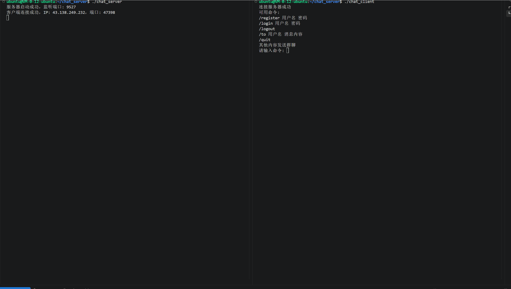
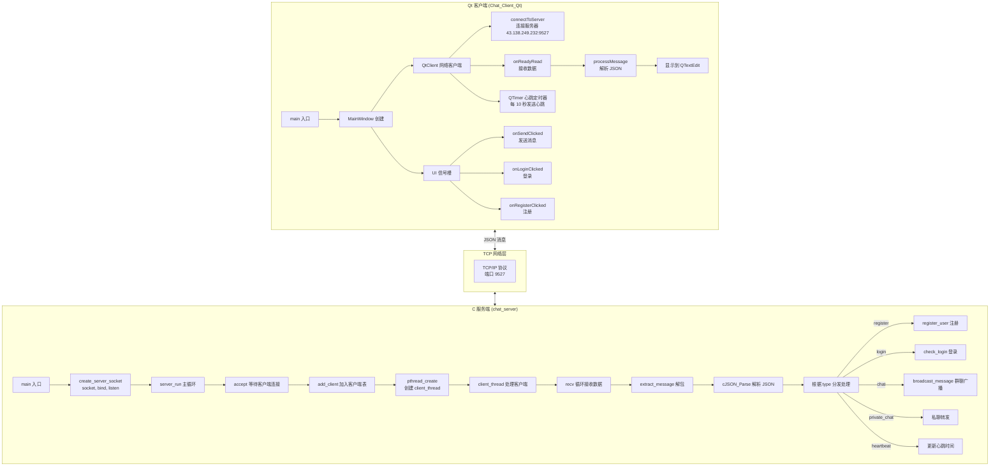
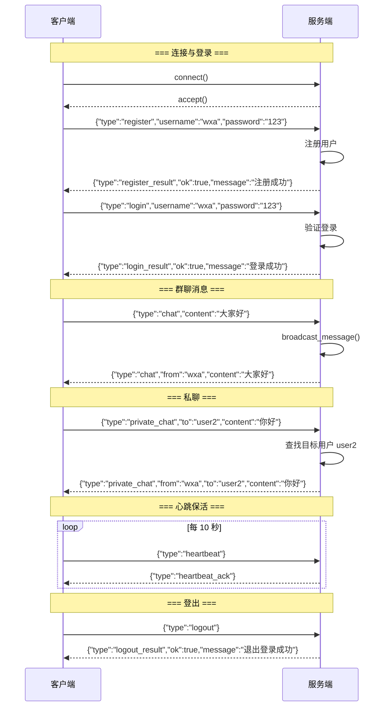
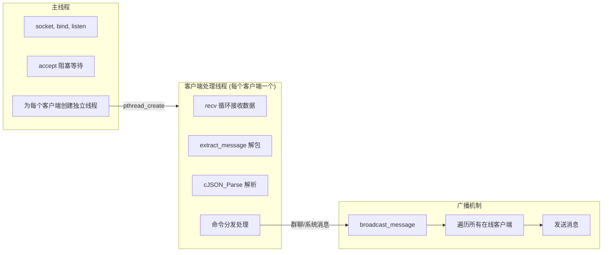
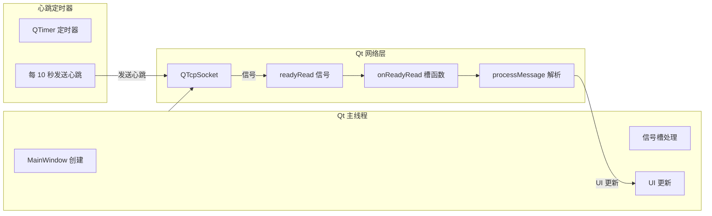
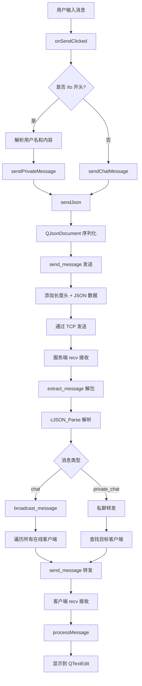

# ChatRoom - 基于 Qt 和 C 的Linux平台聊天室系统

## 项目运行展示

| 服务端 + 客户端（终端） |
|:---:|
|  |

---

## 目录

- [1. 项目概述](#1-项目概述)
- [2. 系统架构](#2-系统架构)
- [3. 项目文件结构](#3-项目文件结构)
- [4. 通信协议设计](#4-通信协议设计)
- [5. 线程模型](#5-线程模型)
- [6. 核心流程详解](#6-核心流程详解)
  - [6.1 服务端流程](#61-服务端流程)
  - [6.2 客户端流程](#62-客户端流程)
  - [6.3 消息收发流程](#63-消息收发流程)
  - [6.4 心跳保活机制](#64-心跳保活机制)
- [7. 关键技术点与 C/C++ 知识点](#7-关键技术点与-cc-知识点)
- [8. 构建与运行](#8-构建与运行)
- [9. 待优化项](#9-待优化项)

---

## 1. 项目概述

ChatRoom 是一个基于 **C + Qt + POSIX Socket** 实现的跨平台聊天室系统。系统采用 **客户端/服务端（C/S）架构**：

- **服务端（Server）**：纯 C 语言实现，运行在 Linux 云服务器上，负责用户注册/登录验证、消息广播、私聊转发、心跳检测。
- **客户端（Client）**：Qt 6 图形界面客户端，支持 Windows/Linux 双平台，负责用户交互、消息显示、连接管理。

**核心特性：**
- TCP 可靠传输
- JSON 格式通信协议（基于 cJSON 库）
- 多线程并发处理（服务端每条客户端连接独立线程）
- 心跳保活机制（服务端主动检测，客户端定时发送）
- 支持群聊 + 私聊
- 用户注册/登录/登出
- Qt 图形界面（QTextEdit 消息显示 + QListWidget 用户列表）
- 跨平台（服务端 Linux，客户端 Windows/Linux）

---

## 2. 系统架构

### 2.1 整体架构图



### 2.2 数据流图



---

## 3. 项目文件结构

```
ChatRoom/
├── chat_server/                        # 服务端（纯 C，Linux）
│   ├── Makefile                        # 编译脚本
│   ├── chat_client                     # 命令行测试客户端（可选）
│   ├── chat_server                     # 服务端可执行文件
│   ├── client/
│   │   └── chat_client.c               # 命令行测试客户端源码
│   ├── include/                        # 公共头文件
│   │   ├── broadcast.h                 # 广播消息声明
│   │   ├── client.h                    # 客户端管理声明
│   │   ├── common.h                    # 公共常量与结构体
│   │   ├── protocol.h                  # 协议层声明
│   │   └── server.h                    # 服务端声明
│   ├── src/                            # 服务端源码
│   │   ├── broadcast.c                 # 广播消息实现
│   │   ├── client.c                    # 客户端管理实现
│   │   ├── main.c                      # 服务端入口
│   │   ├── protocol.c                  # 协议层实现
│   │   └── server.c                    # 服务端核心逻辑
│   └── tests/
│       └── test_protocol.c             # 协议单元测试
│
├── Chat_Client_Qt/                     # Qt 客户端（Windows/Linux）
│   ├── CMakeLists.txt                  # CMake 构建配置
│   ├── main.cpp                        # Qt 入口
│   ├── mainwindow.h                    # 主窗口头文件
│   ├── mainwindow.cpp                  # 主窗口实现
│   ├── mainwindow.ui                   # Qt Designer 界面布局
│   ├── qt_client.h                     # Qt 网络客户端头文件
│   ├── qt_client.cpp                   # Qt 网络客户端实现
│   ├── include/                        # 协议头文件（从服务端复制）
│   │   ├── protocol.h
│   │   └── common.h
│   └── src/                            # 协议源码（从服务端复制）
│       └── protocol.c
│
└── README.md                           # 本文档
```

---

## 4. 通信协议设计

### 4.1 协议结构

系统采用**双层协议**设计：

| 层级 | 协议 | 说明 |
|------|------|------|
| **传输层** | 自定义二进制协议 | 4 字节长度头 + JSON 消息体，解决 TCP 粘包问题 |
| **应用层** | JSON 协议 | 可读性强，易于扩展 |

### 4.2 传输层协议

```
+------------------+------------------+
|   msg_len (4B)   |   msg (变长)     |
+------------------+------------------+
|   网络字节序      |   UTF-8 JSON 文本 |
+------------------+------------------+
```

**结构体定义：**

```c
// protocol.h
typedef struct {
    char buffer[RECV_BUFFER_SIZE];  // 8192 字节接收缓冲区
    size_t data_len;                // 当前缓冲区有效数据长度
} recv_buffer_t;

// 发送消息：自动添加长度头
int send_message(int fd, const char *msg);

// 提取消息：从缓冲区提取一个完整消息
char *extract_message(recv_buffer_t *recv_buf);
```

### 4.3 应用层协议

所有消息均为 JSON 格式，包含 `type` 字段区分消息类型。

**客户端 → 服务端：**

| type | 字段 | 说明 |
|------|------|------|
| `register` | `username`, `password` | 注册请求 |
| `login` | `username`, `password` | 登录请求 |
| `logout` | 无 | 登出请求 |
| `chat` | `content` | 群聊消息 |
| `private_chat` | `to`, `content` | 私聊消息 |
| `heartbeat` | 无 | 心跳包 |

**服务端 → 客户端：**

| type | 字段 | 说明 |
|------|------|------|
| `register_result` | `ok`, `message` | 注册结果 |
| `login_result` | `ok`, `message` | 登录结果 |
| `logout_result` | `ok`, `message` | 登出结果 |
| `chat` | `from`, `content` | 群聊消息 |
| `private_chat` | `from`, `to`, `content` | 私聊消息 |
| `system` | `message`, `username`(可选) | 系统通知 |
| `heartbeat_ack` | 无 | 心跳确认 |
| `error` | `ok`, `message` | 错误信息 |

### 4.4 协议示例

**注册请求：**
```json
{"type":"register","username":"wxa","password":"123456"}
```

**注册响应：**
```json
{"type":"register_result","ok":true,"message":"注册成功"}
```

**群聊消息（客户端发送）：**
```json
{"type":"chat","content":"大家好"}
```

**群聊消息（服务端广播）：**
```json
{"type":"chat","from":"wxa","content":"大家好"}
```

**私聊消息（客户端发送）：**
```json
{"type":"private_chat","to":"user2","content":"你好"}
```

**心跳包：**
```json
{"type":"heartbeat"}
```

### 4.5 协议工具函数

```c
// 发送完整消息（带长度头）
int send_message(int fd, const char *msg);

// 从缓冲区提取完整消息（处理粘包）
char *extract_message(recv_buffer_t *recv_buf);

// 初始化接收缓冲区
void init_recv_buffer(recv_buffer_t *recv_buf);
```

---

## 5. 线程模型

### 5.1 服务端线程模型



**关键设计点：**

1. **每客户端一线程**：服务端为每个连接的客户端创建一个独立的 `client_thread`，实现并发处理。
2. **广播机制**：`broadcast_message` 遍历所有在线客户端，向除发送者外的所有客户端转发消息。
3. **心跳监控**：独立的 `heartbeat_monitor_thread` 定期检查所有客户端的心跳时间，超时则断开连接。
4. **互斥锁保护**：`clients_mutex` 保护客户端表的并发访问，`send_mutex` 保护每个客户端的发送操作。

### 5.2 客户端线程模型



**关键设计点：**

1. **信号槽机制**：Qt 的信号槽实现线程安全的消息传递，`readyRead` 信号在主线程中处理。
2. **QTimer 心跳**：使用 `QTimer` 定时器每 10 秒发送心跳包，比 `sleep` 更优雅且不阻塞 UI。
3. **跨线程 UI 更新**：所有 UI 操作都在主线程中执行，`processMessage` 通过信号槽触发 UI 更新。
4. **粘包处理**：`recv_buffer_t` 缓冲区 + `extract_message` 函数处理 TCP 粘包问题。

---

## 6. 核心流程详解

### 6.1 服务端流程

```
main()
├── signal(SIGPIPE, SIG_IGN)          # 忽略管道破裂信号
├── client_table_init()                # 初始化客户端表
├── pthread_create(monitor_tid)        # 创建心跳监控线程
├── pthread_detach(monitor_tid)        # 分离心跳线程
├── create_server_socket(SERVER_PORT)  # 创建服务端套接字
│   ├── socket(AF_INET, SOCK_STREAM, 0)
│   ├── setsockopt(SO_REUSEADDR)       # 端口重用
│   ├── bind(0.0.0.0:9527)
│   └── listen(10)
├── server_run(server_fd)              # 主循环
│   └── while(1):
│       ├── accept()                   # 阻塞等待客户端连接
│       ├── add_client()               # 加入客户端表
│       ├── malloc(arg)                # 分配客户端 fd 参数
│       ├── pthread_create(client_thread) # 创建客户端处理线程
│       └── pthread_detach(tid)        # 分离线程
└── close(server_fd)                   # 清理资源
```

### 6.2 客户端处理线程 (client_thread)

```
client_thread(client_fd)
├── find_client_index()                # 查找客户端索引
├── broadcast_message(welcome_msg)     # 广播进入聊天室
├── while(1):
│   ├── recv()                         # 阻塞接收数据
│   ├── memcpy 追加到缓冲区
│   ├── while(extract_message()):
│   │   ├── cJSON_Parse()
│   │   ├── 检查 type 字段
│   │   ├── switch(type):
│   │   │   ├── heartbeat → 更新心跳时间，回复 heartbeat_ack
│   │   │   ├── register → register_user()
│   │   │   ├── login → check_login()
│   │   │   ├── logout → 标记登出
│   │   │   ├── chat → broadcast_message()
│   │   │   └── private_chat → 私聊转发
│   │   └── free(msg)
│   └── 处理 TCP 断开/错误
├── broadcast_leave_message()          # 广播离开聊天室
├── remove_client()                    # 从客户端表移除
└── close(client_fd)                   # 关闭套接字
```

### 6.3 客户端流程

```
main()
├── QApplication a(argc, argv)
├── MainWindow w
│   ├── ui->setupUi(this)              # 加载 UI 布局
│   ├── m_client = new QtClient(this)
│   │   ├── QTcpSocket 创建
│   │   ├── QTimer 心跳定时器创建
│   │   └── 信号槽连接
│   ├── m_client->setMessageDisplay()  # 关联消息显示区
│   ├── m_client->setUserList()        # 关联用户列表
│   ├── 按钮信号槽连接
│   └── m_client->connectToServer()    # 连接服务器
└── a.exec()                           # 进入 Qt 事件循环
```

### 6.4 QtClient 网络处理

```
QtClient::connectToServer(ip, port)
└── m_socket->connectToHost(ip, port)

QtClient::onConnected()                 # 连接成功
├── appendMessage("已连接到服务器")
├── emit connected()
└── m_heartbeatTimer->start()           # 启动心跳

QtClient::onReadyRead()                 # 收到数据
├── m_socket->readAll()
├── memcpy 追加到 recv_buffer
└── while(extract_message()):
    └── processMessage(jsonMsg)

QtClient::processMessage(jsonMsg)
├── QJsonDocument::fromJson()
├── 读取 type 字段
├── switch(type):
│   ├── heartbeat_ack → 忽略（静默）
│   ├── system → appendMessage("[系统] ...")
│   ├── chat → appendMessage("[from] content")
│   ├── private_chat → appendMessage("🔒 from (私聊) content")
│   ├── login_result → emit loginResult(ok, msg)
│   └── register_result → emit registerResult(ok, msg)

QtClient::sendHeartbeat()               # 心跳定时器
├── if (已连接):
│   └── send_json({"type":"heartbeat"})
└── else:
    └── m_heartbeatTimer->stop()
```

### 6.5 消息收发流程



---

## 7. 关键技术点与 C/C++ 知识点

### 7.1 网络编程 — POSIX Socket

```c
#include <sys/socket.h>
#include <netinet/in.h>
#include <arpa/inet.h>

// 创建套接字
int fd = socket(AF_INET, SOCK_STREAM, 0);

// 服务端绑定
struct sockaddr_in addr;
addr.sin_family = AF_INET;
addr.sin_port = htons(9527);
addr.sin_addr.s_addr = htonl(INADDR_ANY);
bind(fd, (struct sockaddr*)&addr, sizeof(addr));
listen(fd, 10);

// 客户端连接
inet_pton(AF_INET, "43.138.249.232", &addr.sin_addr);
connect(fd, (struct sockaddr*)&addr, sizeof(addr));

// 发送与接收
send(fd, data, len, 0);
recv(fd, buf, sizeof(buf), 0);

// 关闭
close(fd);
shutdown(fd, SHUT_RDWR);
```

| 知识点 | 说明 |
|--------|------|
| **AF_INET** | IPv4 地址族 |
| **SOCK_STREAM** | TCP 流式套接字 |
| **网络字节序** | `htons()` / `htonl()` 转换为主机到网络字节序 |
| **INADDR_ANY** | 绑定所有本地 IP 地址 |
| **SIGPIPE** | 向已关闭的 socket 写入会触发，用 `signal(SIGPIPE, SIG_IGN)` 忽略 |

### 7.2 多线程编程 — pthread

```c
#include <pthread.h>

// 创建线程
pthread_t tid;
pthread_create(&tid, NULL, thread_func, arg);

// 分离线程（自动回收资源）
pthread_detach(tid);

// 等待线程结束
pthread_join(tid, NULL);

// 互斥锁
pthread_mutex_t mutex = PTHREAD_MUTEX_INITIALIZER;
pthread_mutex_lock(&mutex);
// ... 临界区 ...
pthread_mutex_unlock(&mutex);
```

| 知识点 | 说明 |
|--------|------|
| **pthread_create** | 创建 POSIX 线程，第四个参数为传给线程函数的参数 |
| **pthread_detach** | 分离线程，线程结束后自动回收资源 |
| **pthread_mutex_t** | 互斥锁，保护共享资源 |
| **原子操作** | `stdatomic.h` 中的 `atomic_int` 和 `atomic_load/store` |

### 7.3 JSON 解析 — cJSON

```c
#include <cjson/cJSON.h>

// 创建 JSON 对象
cJSON *root = cJSON_CreateObject();
cJSON_AddStringToObject(root, "type", "login");
cJSON_AddStringToObject(root, "username", username);
cJSON_AddStringToObject(root, "password", password);

// 序列化
char *text = cJSON_PrintUnformatted(root);

// 解析
cJSON *root = cJSON_Parse(json_str);
cJSON *type_item = cJSON_GetObjectItemCaseSensitive(root, "type");
if (cJSON_IsString(type_item)) {
    const char *type = type_item->valuestring;
}

// 释放
cJSON_Delete(root);
free(text);
```

| 知识点 | 说明 |
|--------|------|
| **cJSON_CreateObject** | 创建空 JSON 对象 |
| **cJSON_AddStringToObject** | 添加字符串字段 |
| **cJSON_PrintUnformatted** | 序列化为无格式 JSON 字符串 |
| **cJSON_Parse** | 解析 JSON 字符串为 cJSON 对象 |
| **cJSON_GetObjectItemCaseSensitive** | 区分大小写获取字段 |
| **cJSON_IsString** | 检查字段类型是否为字符串 |

### 7.4 粘包处理

```c
// 发送时：4 字节长度头 + 消息体
int send_message(int fd, const char *msg) {
    uint32_t len = htonl(strlen(msg));
    char *packet = malloc(4 + strlen(msg));
    memcpy(packet, &len, 4);
    memcpy(packet + 4, msg, strlen(msg));
    send_all(fd, packet, 4 + strlen(msg));
    free(packet);
}

// 接收时：从缓冲区提取完整消息
char *extract_message(recv_buffer_t *buf) {
    if (buf->data_len < 4) return NULL;
    uint32_t len = ntohl(*(uint32_t*)buf->buffer);
    if (buf->data_len < 4 + len) return NULL;
    char *msg = malloc(len + 1);
    memcpy(msg, buf->buffer + 4, len);
    msg[len] = '\0';
    // 移除已处理的数据
    memmove(buf->buffer, buf->buffer + 4 + len, buf->data_len - 4 - len);
    buf->data_len -= 4 + len;
    return msg;
}
```

### 7.5 Qt 信号槽机制

```cpp
#include <QObject>
#include <QTimer>

// 信号声明
class QtClient : public QObject {
    Q_OBJECT
signals:
    void loginResult(bool ok, const QString &msg);
    void registerResult(bool ok, const QString &msg);
};

// 连接信号槽
connect(m_client, &QtClient::loginResult, 
        this, &MainWindow::onLoginResult);

// Lambda 连接
connect(ui->pushButton_send, &QPushButton::clicked, 
        this, [this]() { onSendClicked(); });

// Qt 定时器（用于心跳）
QTimer *m_heartbeatTimer = new QTimer(this);
connect(m_heartbeatTimer, &QTimer::timeout, this, &QtClient::sendHeartbeat);
m_heartbeatTimer->setInterval(10000);  // 10 秒
```

### 7.6 CMake 构建配置

```cmake
cmake_minimum_required(VERSION 3.16)
project(Chat_Client VERSION 1.0 LANGUAGES CXX C)

set(CMAKE_AUTOUIC ON)    # 自动处理 .ui 文件
set(CMAKE_AUTOMOC ON)    # 自动处理 Q_OBJECT 宏
set(CMAKE_AUTORCC ON)    # 自动处理 .qrc 资源

find_package(QT NAMES Qt6 Qt5 REQUIRED COMPONENTS Widgets Network)

# 添加 C 源文件
set(PROJECT_SOURCES
    main.cpp
    mainwindow.cpp
    mainwindow.h
    mainwindow.ui
    qt_client.cpp
    src/protocol.c
)

# 强制 protocol.c 作为 C 语言编译
set_source_files_properties(src/protocol.c PROPERTIES LANGUAGE C)

qt_add_executable(Chat_Client ${PROJECT_SOURCES})

target_link_libraries(Chat_Client PRIVATE
    Qt${QT_VERSION_MAJOR}::Widgets
    Qt${QT_VERSION_MAJOR}::Network
    pthread
    cjson
)
```

---

## 8. 构建与运行

### 8.1 环境要求

| 组件 | 服务端 | 客户端 |
|------|--------|--------|
| 操作系统 | Linux（Ubuntu 20.04+） | Windows 10/11 或 Linux |
| 编译器 | GCC 9+ | GCC 9+ 或 MSVC 2019+ |
| 构建工具 | Make | CMake 3.16+ |
| 依赖库 | libcjson-dev | Qt 6/5 + cjson |
| 网络 | 公网 IP 或局域网 | 能访问服务端 IP |

### 8.2 服务端构建与运行

```bash
# 1. 安装依赖
sudo apt update
sudo apt install build-essential libcjson-dev

# 2. 进入服务端目录
cd ~/chat_server

# 3. 编译
make clean && make

# 4. 运行
./chat_server
```

**服务端输出：**
```
服务器启动成功，监听端口: 9527
客户端连接成功，IP: 110.53.241.168，端口: 17996
```

### 8.3 客户端构建与运行

**在 Qt Creator 中打开：**

```bash
# 1. 安装 Qt 6
sudo apt install qt6-base-dev qt6-tools-dev

# 2. 进入客户端目录
cd ~/Chat_Client_Qt

# 3. 在 Qt Creator 中打开
qtcreator CMakeLists.txt &
```

**命令行构建：**

```bash
cd ~/Chat_Client_Qt
rm -rf build_cmd
mkdir build_cmd
cd build_cmd
cmake ..
make -j4
./Chat_Client
```

### 8.4 配置说明

| 配置项 | 位置 | 默认值 |
|--------|------|--------|
| 服务器 IP | `chat_client.c` / `mainwindow.cpp` | `43.138.249.232` |
| 服务器端口 | `common.h` | `9527` |
| 心跳间隔 | `common.h` | `10` 秒 |
| 心跳超时 | `common.h` | `30` 秒 |
| 最大客户端数 | `common.h` | `100` |
| 接收缓冲区 | `common.h` | `8192` 字节 |

### 8.5 使用流程

1. **启动服务端**：在云服务器上运行 `./chat_server`
2. **启动客户端**：在本地运行 `Chat_Client`
3. **注册账号**：输入用户名和密码，点击"注册"
4. **登录账号**：点击"登录"
5. **群聊**：在输入框输入文字，点击"发送"
6. **私聊**：输入 `/to 用户名 消息内容`

---

## 9. 待优化项

| 优先级 | 项目 | 说明 |
|--------|------|------|
| 高 | 在线用户列表 | 服务端需支持 `user_list` 消息，客户端显示在线用户 |
| 高 | 断线重连 | 客户端断开后自动重连（已部分实现心跳） |
| 高 | 错误处理 | `recv`/`send` 返回 ≤0 时完善错误恢复 |
| 中 | 消息历史 | 客户端保存聊天记录 |
| 中 | 消息时间戳 | 每条消息显示发送时间 |
| 中 | 密码加密 | 使用 bcrypt/SHA256 存储密码哈希 |
| 中 | 消息队列 | 离线消息存储与推送 |
| 低 | 文件传输 | 支持图片/文件发送 |
| 低 | 消息通知 | 新消息系统托盘提醒 |
| 低 | 界面美化 | QSS 样式表美化界面 |
| 低 | 语音/视频 | WebRTC 集成 |

---

## 知识索引

本项目涉及的 C/C++/Qt 核心知识点速查：

```
┌─ 网络编程 (POSIX Socket)
│  ├─ socket/AF_INET/SOCK_STREAM
│  ├─ bind/listen/accept
│  ├─ connect/send/recv
│  ├─ htons/htonl/ntohs/ntohl
│  └─ inet_pton/inet_ntop
├─ 多线程 (pthread)
│  ├─ pthread_create/pthread_detach/pthread_join
│  ├─ pthread_mutex_t 互斥锁
│  └─ stdatomic.h 原子操作
├─ JSON 处理 (cJSON)
│  ├─ cJSON_CreateObject/cJSON_AddStringToObject
│  ├─ cJSON_PrintUnformatted/cJSON_Parse
│  └─ cJSON_GetObjectItemCaseSensitive/cJSON_Delete
├─ 协议设计
│  ├─ 4 字节长度头 + 消息体（粘包处理）
│  └─ JSON 应用层协议
├─ Qt 框架
│  ├─ QApplication / QMainWindow
│  ├─ QTextEdit / QListWidget / QLineEdit / QPushButton
│  ├─ QTcpSocket / QTcpServer
│  ├─ QJsonDocument / QJsonObject / QJsonArray
│  ├─ 信号槽 (connect / emit)
│  ├─ QTimer 定时器
│  └─ Qt Designer (.ui 文件)
├─ CMake 构建
│  ├─ CMAKE_AUTOUIC / CMAKE_AUTOMOC
│  ├─ find_package(Qt6 ...)
│  └─ set_source_files_properties (C 语言编译)
└─ 跨平台
   ├─ Linux (服务端) + Windows/Linux (客户端)
   ├─ 虚拟网络 (云服务器公网 IP)
   └─ 终端 + GUI 双客户端
```

---

## 10. 快速上手命令汇总

```bash
# === 服务端 ===
cd ~/chat_server
make clean && make
./chat_server

# === 客户端 (Qt Creator) ===
cd ~/Chat_Client_Qt
qtcreator CMakeLists.txt &
# 然后点击绿色三角形 ▶️ 运行

# === 客户端 (命令行) ===
cd ~/Chat_Client_Qt
rm -rf build_cmd && mkdir build_cmd && cd build_cmd
cmake .. && make -j4
./Chat_Client

# === 同时运行多个客户端 ===
./Chat_Client &
./Chat_Client &

# === Git 操作 ===
git status
git add .
git commit -m "更新代码"
git push origin main
```

---

**项目完成！** 🎉
